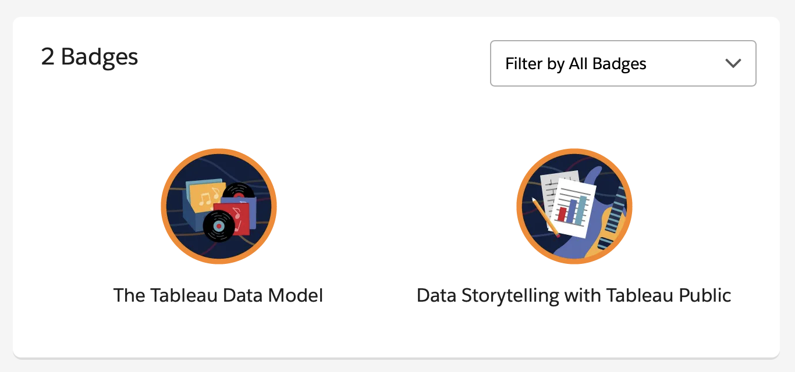
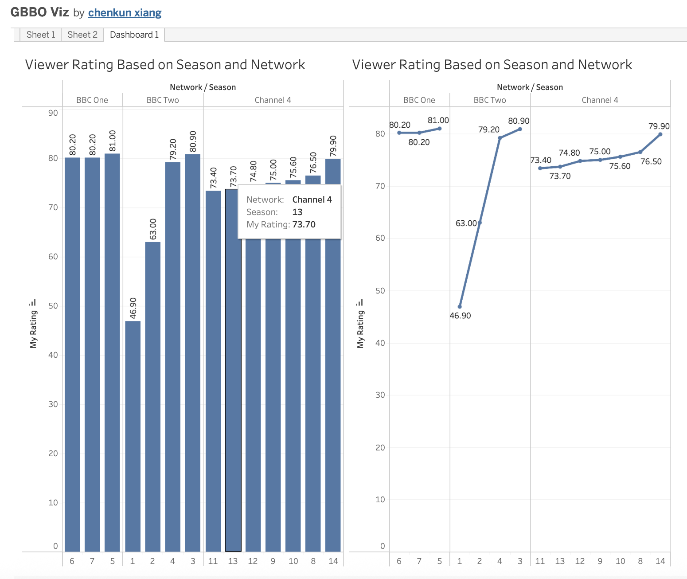

# Tableau Assignment

Badges from Trailhead Modules

Tableau Viz 
[Viz Link](https://public.tableau.com/app/profile/chenkun.xiang/viz/GBBOViz_17641765936990/Dashboard1#1)

---

The most important data storytelling principle I applied was designing for clarity and quick insight, which shaped my GBBO visualization by using descending order to immediately highlight which seasons and networks achieved the highest viewership—allowing viewers to instantly see trends without searching through the data. Understanding relationships versus joins in Tableau's data model is crucial because relationships preserve the granularity of each table and prevent data duplication, which matters significantly when working with real-world datasets that have different levels of detail (like patient records at different frequencies). In a healthcare scenario, Tableau would be ideal for tracking patient outcomes across multiple related tables—such as linking patient demographics, hospital visits, lab results, and diagnoses—because its relationship-based data model maintains proper granularity while allowing interactive dashboards that let clinicians filter by time period, department, or diagnosis to identify patterns in readmission rates or treatment effectiveness. Tableau's strength lies in connecting these disparate healthcare data sources without creating bloated datasets, while simultaneously enabling visual storytelling that transforms complex clinical data into actionable insights for improving patient care and operational efficiency.
